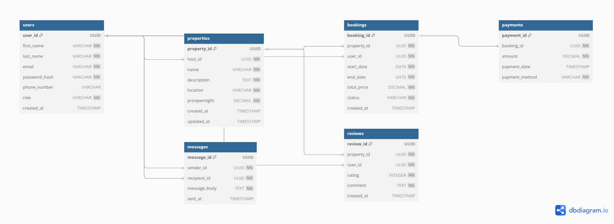

# Entity Relationship Diagram (ERD) for Airbnb Clone

This ERD models the database structure for the Airbnb Clone project. It includes the following entities:

- User
- Property
- Booking
- Payment
- Review
- Message

Each entity includes relevant fields and constraints, such as UUID primary keys, foreign key relationships, and ENUM constraints.

## 🔗 View the Live Diagram

You can view the full interactive ER diagram here:
👉 [Click to view the ERD on dbdiagram.io][https://dbdiagram.io/d/your-diagram-id-here](https://dbdiagram.io/d/685d5d05f413ba35080b2f2c)

> 💡 Tip: Right-click the link or use Ctrl+Click (or Cmd+Click on Mac) to open it in a new tab.

> ℹ️ The interactive diagram includes tooltips showing field-level constraints like `unique`, `not null`, and `default`. These details may not appear in the exported image or PDF.

## 📎 Diagram Preview

## 📄 DBML Code

If you’d like to review the raw DBML schema:

Click to expand

// Airbnb Clone Database Design in DBML

Table users {
  user_id UUID [primary key]
  first_name VARCHAR [not null]
  last_name VARCHAR [not null]
  email VARCHAR [unique, not null, note: 'Must be unique']
  password_hash VARCHAR [not null]
  phone_number VARCHAR
  role VARCHAR [not null, note: 'ENUM (guest, host, admin)']
  created_at TIMESTAMP [default: `CURRENT_TIMESTAMP`]
}

Table properties {
  property_id UUID [primary key]
  host_id UUID [not null]
  name VARCHAR [not null]
  description TEXT [not null]
  location VARCHAR [not null]
  pricepernight DECIMAL [not null]
  created_at TIMESTAMP [default: `CURRENT_TIMESTAMP`]
  updated_at TIMESTAMP [note: 'ON UPDATE CURRENT_TIMESTAMP']
}

Table bookings {
  booking_id UUID [primary key]
  property_id UUID [not null]
  user_id UUID [not null]
  start_date DATE [not null]
  end_date DATE [not null]
  total_price DECIMAL [not null]
  status VARCHAR [not null, note: 'ENUM (pending, confirmed, canceled)']
  created_at TIMESTAMP [default: `CURRENT_TIMESTAMP`]
}

Table payments {
  payment_id UUID [primary key]
  booking_id UUID [not null]
  amount DECIMAL [not null]
  payment_date TIMESTAMP [default: `CURRENT_TIMESTAMP`]
  payment_method VARCHAR [not null, note: 'ENUM (credit_card, paypal, stripe)']
}

Table reviews {
  review_id UUID [primary key]
  property_id UUID [not null]
  user_id UUID [not null]
  rating INTEGER [not null, note: 'CHECK rating BETWEEN 1 AND 5']
  comment TEXT [not null]
  created_at TIMESTAMP [default: `CURRENT_TIMESTAMP`]
}

Table messages {
  message_id UUID [primary key]
  sender_id UUID [not null]
  recipient_id UUID [not null]
  message_body TEXT [not null]
  sent_at TIMESTAMP [default: `CURRENT_TIMESTAMP`]
}

// Foreign Key Relationships
Ref: properties.host_id > users.user_id
Ref: bookings.user_id > users.user_id
Ref: bookings.property_id > properties.property_id
Ref: payments.booking_id > bookings.booking_id
Ref: reviews.user_id > users.user_id
Ref: reviews.property_id > properties.property_id
Ref: messages.sender_id > users.user_id
Ref: messages.recipient_id > users.user_id

## 🧩 Entities and Relationships Overview

This ERD includes the following entities:

- **User**: Represents guests, hosts, or admins. Uniquely identified by `user_id`. Hosts own properties. Guests make bookings and leave reviews.
- **Property**: Listings created by hosts. Each property is tied to a host via `host_id`.
- **Booking**: Represents a reservation made by a guest for a specific property. Includes `start_date`, `end_date`, and `status`.
- **Payment**: Linked to a booking and records payment details such as `amount`, `method`, and `payment_date`.
- **Review**: Submitted by a user for a property, including a rating and comment. Each review is tied to a user and a property.
- **Message**: Represents messages exchanged between users (e.g., guest ↔ host). Includes sender and recipient IDs.

### 🔗 Relationships Summary

| Relationship                       | Type         | Description                                  |
|-----------------------------------|--------------|----------------------------------------------|
| `User` 1 ──< `Property`           | One-to-Many  | One host can list many properties            |
| `User` 1 ──< `Booking`           | One-to-Many  | One guest can make many bookings             |
| `Property` 1 ──< `Booking`       | One-to-Many  | A property can have many bookings            |
| `Booking` 1 ──1 `Payment`        | One-to-One   | Each booking has one payment                 |
| `User` 1 ──< `Review`            | One-to-Many  | One user can write multiple reviews          |
| `Property` 1 ──< `Review`        | One-to-Many  | One property can have multiple reviews       |
| `User` 1 ──< `Message` (Sender)  | One-to-Many  | One user can send many messages              |
| `User` 1 ──< `Message` (Receiver)| One-to-Many  | One user can receive many messages           |
